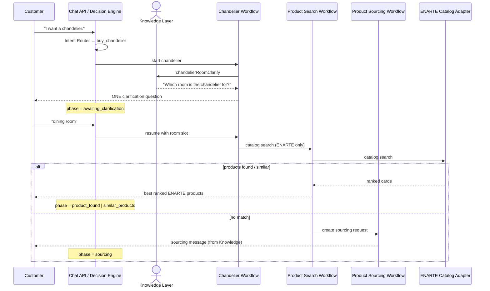

# Sprint 3 — First Working Customer Journey (Chandelier)

## Customer journey diagram

## State transitions

| From | Event / action | To |
|------|----------------|-----|
| `welcome` | user: want chandelier / Chandeliers button | `product_search` entry → leaf `clarify` |
| `*` | workflow action `clarify` | `awaiting_clarification` |
| `awaiting_clarification` | room reply (chandelier context) | resume `chandelier` → `product_search` |
| `product_search` | `products_found` | `product_found` |
| `product_search` | `similar_products` | `similar_products` |
| `product_search` | `sourcing_triggered` | `sourcing` |

Conversation state also stores:

- `currentWorkflow: "chandelier"`
- `context.awaitingChandelierRoom`
- `selectedRoom.name` after the room reply
- `clarification.active` while waiting for the room

## Workflow implementation

**`chandelier` workflow** (`workflows/chandelier.js`):

1. If room missing → return `action: "clarify"` with Knowledge Layer question (exactly one).
2. If room present → `executeWorkflow("product_search")` with chandelier category artifacts.
3. Product Search returns ranked ENARTE cards or delegates to Product Sourcing.
4. OpenAI remains disabled; catalog only via `catalog.search`.

## Files added / updated

### Added
- `app/services/assistant/workflows/chandelier.js`
- `app/services/assistant/chandelier-journey.test.js`
- `app/services/assistant/SPRINT3_CHANDELIER_JOURNEY.md` (this file)

### Updated
- `workflows/registry.js` — register chandelier
- `config/intent-catalog.js` — `buy_chandelier` intent (priority 86)
- `ux/smart-actions.js` — Chandeliers → chandelier workflow
- `brain/decision-engine.js` — resume after room clarify; room state
- `brain/transitions.js` — `WORKFLOW_ENTRY_PHASE.chandelier`
- `ux/format-response.js` — prefer workflow clarify message
- `knowledge/documents/assistant-personality.js` — `chandelierRoomClarify`
- `knowledge/schemas/content.js` — message key
- `brain.test.js`, `integration.test.js`, `package.json`
