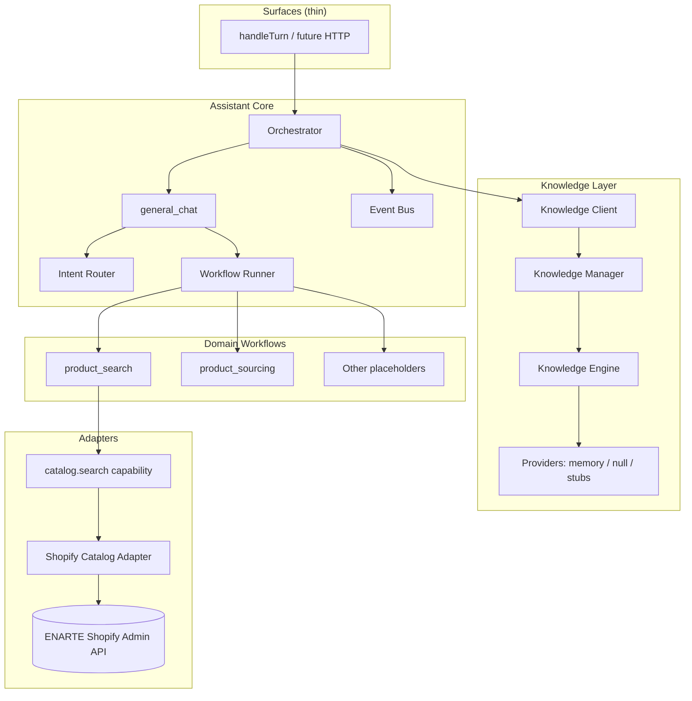
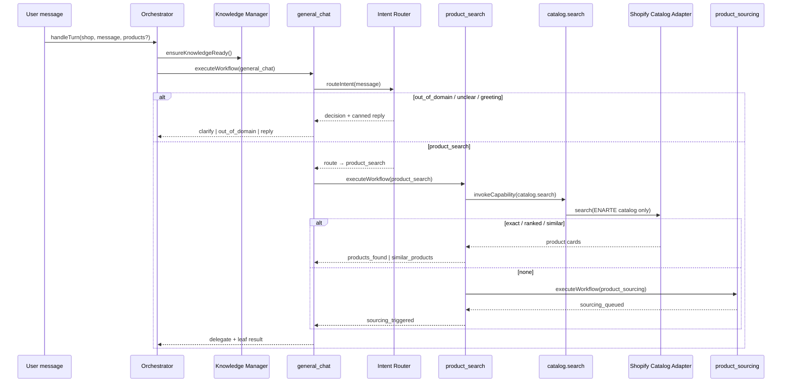

# Sprint 3 — Integration & Validation Report

**Date:** 2026-07-13  
**Status:** Passed (`npm run test:assistant` → **34/34**)  
**Scope:** Validate architecture only — no new user-facing features.

---

## 1. Verification summary

| Module | Status | Evidence |
|--------|--------|----------|
| Intent Router | OK | E2E: clarify, out-of-domain, product route |
| Workflow Engine | OK | `handleTurn` → `general_chat` → delegate |
| Knowledge Engine | OK | Providers + module registry |
| Knowledge Manager | OK | Load / validate / cache in E2E setup |
| Product Search Workflow | OK | Cards + sourcing fallback |
| Shopify Catalog Adapter | OK | Only adapter loads catalog; capability boundary |

### Boundary checks (automated)

- Workflows do **not** import `shopify-products.server`, `openai`, or `knowledge/placeholders`
- `product_search` uses `invokeCapability("catalog.search")` only (no direct adapter import)
- Only `adapters/shopify-catalog.js` may load `loadEnarteCatalog`
- LLM disabled; internet product search disabled

### E2E scenarios

| Scenario | Result |
|----------|--------|
| Product found | `products_found` / strong card match |
| Multiple products found | ≥2 crystal chandelier cards |
| Similar products found | Weak query → similar/ranked ENARTE cards |
| Product not found | `sourcing_triggered` → `product_sourcing` |
| Unknown intent | `clarify` (one question) |
| Unsupported request | `out_of_domain` |

---

## 2. Current architecture diagram



---

## 3. Data flow diagram



---

## 4. Refactors done in Sprint 3

1. **`product_search` → capability interface**  
   Removed direct `getShopifyCatalogAdapter()` import; now uses `invokeCapability("catalog.search")`.

2. **Orchestrator pass-through**  
   Forwards `products` / `query` into workflows (test harness + future API without leaking Shopify into orchestrator).

3. **Integration suite**  
   Added `integration.test.js` + `npm run test:integration` / `test:assistant`.

---

## 5. Remaining gaps

| Gap | Severity | Notes |
|-----|----------|--------|
| No HTTP API for assistant turns | Medium | Status route only; messages API not built |
| Knowledge content empty | Medium | Schemas/placeholders only — no real ENARTE FAQ/delivery copy |
| Canned replies in intent-catalog | Low | Specialization copy should move to `assistant_personality` knowledge |
| Intent matching is keyword-only | Medium | Ambiguous Arabic/English queries need better catalog + tests |
| Live Shopify E2E not in CI | Medium | Tests inject catalog; need optional live smoke with session |
| Persistence adapter stub | Low | Conversations not written to Prisma yet |
| Rate limiting / auth on public APIs | High (prod) | Existing try APIs + future assistant API need hardening |
| `general_chat` ↔ `executeWorkflow` coupling | Low | Acceptable for dispatcher; could be port-based later |

---

## 6. Technical debt

| Item | Debt | Recommendation |
|------|------|----------------|
| Dual path Engine + Manager | Mild complexity | Keep Manager as workflow façade; Engine as provider resolver (document clearly) |
| Ranking thresholds in code | Config debt | Move `SEARCH_CONFIG` into assistant config / knowledge later |
| Preferred shop in `shopify-products.server.js` | Pre-existing | Outside assistant module; don't duplicate in adapter |
| Placeholder workflows still `createWorkflowStub` alias | Cosmetic | Rename imports to `createPlaceholderWorkflow` when touched |
| Architecture snapshot `businessLogic: false` | Naming | Means “no hardcoded ENARTE policy rules”; ranking is search logic |

**Unnecessary complexity avoided:** no LLM SDK, no separate microservice, no duplicate catalog fetchers in workflows.

---

## 7. Recommended Sprint 4

**Goal:** First production-facing assistant API + knowledge content bootstrap — still **no** image search / room analysis / virtual placement / free-form LLM chat.

1. **`POST /api/assistant/messages`** (and sessions) wired to `handleTurn`
2. **Populate** `assistant_personality` + `faq` placeholders with real config-backed copy (via Knowledge Manager, not workflows)
3. **Move** intent canned replies into `assistant_personality` knowledge
4. **Optional live catalog smoke** script (shop session required)
5. **Hardening:** rate limit + shop scoping on assistant routes
6. Explicitly **defer:** OpenAI chat, image search, room analysis, virtual placement

---

## 8. How to re-validate

```bash
npm run test:assistant
# or individually:
npm run test:knowledge
npm run test:product-search
npm run test:integration
```

Foundation is solid enough to proceed to Sprint 4 without new AI/vision features.
